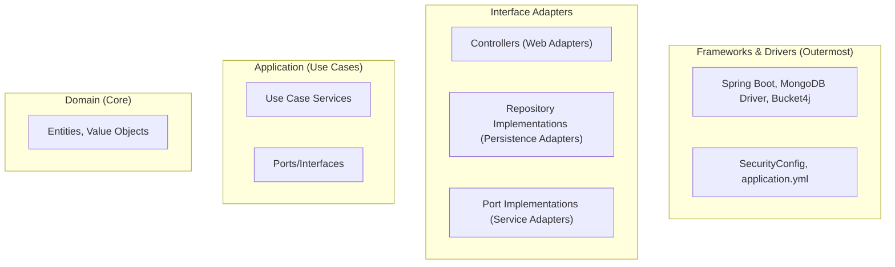

https://claude.ai/share/6945b987-8f20-434b-824e-f9846d8ccc19

# Chat Conversation

Note: _This is purely the output of the chat conversation and does not contain any raw data, codebase snippets, etc. used to generate the output._

### User Input

# Coding Agent Prompt: User Management System Planning (Clean Architecture)

## Task
Plan a complete User Management system using Clean Architecture principles. **Do not write any code.** Instead, provide a comprehensive architectural plan that covers all aspects of the design.

## Requirements to Address

### Functional Requirements
- User registration (email/password)
- User authentication (login/logout)
- Password reset flow
- User profile management (view, update)
- Role-based access control (Admin, User, Guest)
- Account deactivation/deletion
- Email verification

### Planning Deliverables

1. **Layer Structure**
   - Define each Clean Architecture layer (Entities, Use Cases, Interface Adapters, Frameworks & Drivers)
   - Explain the responsibility of each layer in the context of user management
   - Describe the dependency rule and how it applies

2. **Domain Layer Design**
   - List all domain entities and their properties
   - Identify value objects (Email, Password, UserId, etc.)
   - Define domain events that should be raised
   - Outline domain validation rules and invariants

3. **Use Cases Inventory**
   - List every use case needed for user management
   - For each use case, describe: input, output, business rules, and error scenarios
   - Identify which use cases require authorization

4. **Interface Adapters**
   - Design the repository interfaces needed
   - Plan the presenter/controller structure
   - Define DTOs for request/response mapping
   - Outline the authentication gateway interface

5. **Infrastructure Considerations**
   - Database schema design (tables, relationships)
   - External service integrations (email service, token service)
   - Caching strategy for user sessions
   - Security considerations (password hashing, token storage)

6. **Cross-Cutting Concerns**
   - Logging strategy
   - Error handling approach
   - Validation pipeline
   - Audit trail for user actions

7. **Folder/Project Structure**
   - Propose the directory organization
   - Define project/module boundaries
   - Explain how dependencies flow between projects

8. **Testing Strategy**
   - Unit testing approach per layer
   - Integration testing boundaries
   - What to mock at each layer

## Output Format
Organize your plan with clear headings and subheadings. Use diagrams described in text where helpful (e.g., dependency flow, layer interactions). Include rationale for key architectural decisions.

*Listed directory [clean-architecture-approach](file:///home/xack/Desktop/ai-hackathon/agentic-ide-antigravity/clean-architecture-approach) *

*Edited relevant file*

### Planner Response

Now I'll create the comprehensive implementation plan for the User Management System architecture. Since this is a planning-only task (no code to write), the implementation plan will serve as the architectural design document.

*Edited relevant file*

*Edited relevant file*

### User Input

Yes proceed with an implementation of all the stories below using Java Spring boot 4 and MongoDB as database. Also consider yourself as an software architect and system design expert.

1) Register User
User Story
As a new user, I want to register an account using my identity details so that I can securely access the system and receive communications relevant to my account.
Business Rules & Complex Validation
Identity uniqueness


Email must be unique (case-insensitive, trimmed, normalized; treat User+tag@gmail.com vs user@gmail.com based on your email-normalization policy).


Phone must be unique (E.164 normalized).


Username (if used) must be unique and cannot be a reserved word (e.g., admin, support, system, root).


Email validation


Must be syntactically valid.


Domain must not be in a blocked list (temporary email domains, known spam domains).


Optional: Must pass MX-record check (if your architecture supports it).


Phone validation


Must be valid for the chosen country.


If country is Bangladesh, enforce operator prefix rules (config-driven).


Name validation


Full name length 2–80, must not contain profanity or restricted keywords.


Must not be only symbols/digits.


Password policy


Min length (e.g., 12), must include at least 3 of 4 categories (upper/lower/digit/symbol).


Must not contain email, username, or common dictionary words.


Must not match any of last N passwords (if re-register scenario exists).


Must not be in a known breached-password list (conceptual integration).


Age / eligibility


If date of birth is collected: must be within allowed range and meet minimum age requirement.


Terms & consent


User must accept Terms + Privacy Policy versions (store version numbers).


Marketing consent optional and must be explicitly opted-in (no default opt-in).


Risk and fraud checks


Rate limit registration attempts per IP / device fingerprint.


Block if too many attempts or suspicious patterns (same device creating many accounts).


Optional: challenge step (captcha/OTP) based on risk score.


Account state


New user state is PendingVerification until email/phone verified, or Active if verification is disabled by policy.


Audit


Record registration metadata: timestamp, channel, IP, device info (if available), consent versions.


Acceptance Criteria
AC1: Registration fails if email already exists (case-insensitive) with a clear error message.


AC2: Registration fails if phone already exists after normalization.


AC3: Password must satisfy policy; failure returns specific rule violations (without leaking sensitive info).


AC4: Terms and privacy policy acceptance is mandatory; registration cannot complete without it.


AC5: If risk threshold is exceeded, registration is blocked or requires additional verification (policy-driven).


AC6: On success, user is created with correct initial status and audit metadata captured.


AC7: Personally identifiable data is stored following masking/at-rest encryption policy (implementation detail later).


Definition of Done
Story includes validation rules documented and test cases listed.


Domain invariants are enforceable regardless of API (no bypass).


Audit trail recorded.


Error responses standardized.


2) View User Profile
User Story
As an authenticated user, I want to view my profile so that I can verify my personal information and account status.
Business Rules & Complex Validation
Authorization


A user can view their own profile.


Admin can view any user profile, but only with the UserRead permission.


Some sensitive fields (e.g., national ID, security flags) only visible to specific roles.


Data minimization


Do not return secrets: password hash, security answers, internal risk scores.


Mask sensitive fields: partially mask phone/email based on policy unless user re-verifies access.


Consistency rules


If the user is Deactivated, profile view must still be allowed for admin, but user may be restricted (policy-driven).


Privacy & compliance


If user requests data restriction, certain fields must be hidden.


Audit


Log access to profile by admin including reason code (optional policy).


Acceptance Criteria
AC1: User can fetch their own profile and sees only allowed fields.


AC2: User cannot view another user’s profile unless they have admin permissions.


AC3: Response excludes all secrets and internal-only fields.


AC4: Masking rules apply to sensitive fields based on policy.


AC5: Admin profile access is logged (who, when, which user).


Definition of Done
RBAC rules implemented and test-covered.


Response contract documented.


Audit logging for privileged access.


3) Update User Profile (With Rules)
User Story
As an authenticated user, I want to update permitted profile fields so that my account information remains accurate while preserving security and compliance constraints.
Updatable Fields (Example Policy)
Allowed: display name, address, photo URL, phone (with verification), secondary email (optional), preferences.
 Not allowed: primary email (or allowed only via special flow), username (rare), DOB (restricted), roles, status flags.
Business Rules & Complex Validation
Field-level permissions


Normal user can update only “self-editable” fields.


Admin can update additional fields but not security-critical ones without elevated permission.


Change constraints


Phone change requires OTP verification; until verified, set PhonePendingVerification and keep old phone active or freeze operations (policy-driven).


Email change (if allowed) requires re-authentication + email verification; old email remains until verified.


DOB can only be changed once or only by admin with reason.


Data validation


Address fields validated by country rules; postal code format by country.


Photo URL must be from allowed domains/CDNs or pass content policy.


Names cannot contain restricted/profane terms.


Concurrency


Use optimistic concurrency: updates require profile version/etag; reject if stale to prevent overwrites.


Security checks


Re-auth required for sensitive changes (phone/email).


Rate limit profile edits to prevent abuse (e.g., 10 changes/day).


Audit


Log each changed field with before/after (PII-safe: store hashes or masked versions where required).


Acceptance Criteria
AC1: User can update allowed fields; disallowed fields are rejected.


AC2: Changing phone/email triggers verification workflow and sets correct interim status.


AC3: Update requests with stale version/etag are rejected with a conflict error.


AC4: Validation rules are applied per field and return actionable messages.


AC5: Update actions are audited (who, what changed, when).


Definition of Done
Field-level policy documented and enforced.


Concurrency handled.


Verification triggers exist (even if mocked).


Tests cover user vs admin scenarios.


4) Change Password
User Story
As an authenticated user, I want to change my password so that I can keep my account secure.
Business Rules & Complex Validation
Re-authentication


Requires current password (or equivalent step if SSO).


If user recently logged in, may allow within “reauth window” (policy-driven).


Password policy


Must meet complexity rules (length, categories, breached list).


Must not match last N passwords.


Must not contain personal identifiers (email, phone, name fragments).


Attack prevention


Rate limit wrong current-password attempts; lockout or step-up verification after threshold.


Invalidate all sessions/tokens after successful password change (or keep current session only, policy-driven).


Account status


Deactivated users cannot change password unless admin reactivates or recovery flow is used.


Audit


Record password change event without storing password content.


Acceptance Criteria
AC1: Password change fails if current password is incorrect and counts toward lockout thresholds.


AC2: New password must pass policy + history checks.


AC3: On success, sessions are invalidated according to policy.


AC4: Password change is logged as a security event.


Definition of Done
Password rules centralized.


History enforcement works.


Token/session invalidation behavior documented and tested.


5) Deactivate / Activate User
User Story
As an admin (or authorized system), I want to deactivate or reactivate a user so that access can be controlled for security, compliance, or operational reasons.
Business Rules & Complex Validation
Authorization


Only users with UserStatusManage can deactivate/activate.


You cannot deactivate yourself unless you have a special permission (prevents lockout).


Protected accounts


Certain accounts cannot be deactivated (system accounts, service accounts) unless super-admin.


Reason & evidence


Deactivation requires a reason code (e.g., fraud, requested, policy violation).


Optional evidence/reference ID required for certain reasons.


Side effects


Deactivation revokes all active sessions immediately.


Pending operations may be canceled or frozen (policy-driven).


Activation may require password reset if deactivation reason was security-related.


State transitions


Only allow valid transitions: Active → Deactivated; Deactivated → Active.


Cannot activate a user who is permanently banned without special override.


Acceptance Criteria
AC1: Unauthorized users cannot deactivate/activate accounts.


AC2: Deactivation requires reason code; missing reason fails validation.


AC3: Deactivation revokes sessions and blocks login immediately.


AC4: Activation enforces any “security re-entry” requirements (e.g., force reset).


AC5: All actions are audited with actor + reason.


Definition of Done
State machine rules implemented.


Session revocation strategy defined.


Audit logs complete and queryable.


6) Role Assignment (Basic RBAC)
User Story
As an admin, I want to assign and revoke roles for a user so that users have appropriate permissions to perform their duties.
Business Rules & Complex Validation
Authorization


Admin must have RoleManage permission.


Role changes require “least privilege” enforcement: you cannot assign roles higher than your own privilege level.


Role constraints


Mutually exclusive roles (e.g., Auditor cannot be combined with Cashier if segregation-of-duties is required).


Some roles require prerequisites (e.g., Manager requires verified email + active status).


User state


Deactivated users cannot be granted new roles (policy-driven).


Approval workflow (optional but realistic)


High-risk roles (e.g., SuperAdmin) require dual approval (second admin).


Audit


Record who granted/revoked which role, when, and why.


Acceptance Criteria
AC1: Only authorized admins can change roles.


AC2: System prevents assigning roles above admin’s privilege level.


AC3: Conflicting role combinations are rejected with explicit reason.


AC4: High-risk roles follow approval rules if enabled.


AC5: Role change history is recorded and retrievable.


Definition of Done
RBAC rules documented and enforced.


Conflict/prerequisite rules are configurable (policy-driven).


Audit + optional approval flow supported.


7) Search / List Users (Basic Admin)
User Story
As an admin, I want to search and list users by different criteria so that I can manage accounts efficiently.
Business Rules & Complex Validation
Authorization


Requires UserRead permission; exporting may require UserExport.


PII protection


Search results must mask sensitive fields by default.


Searching by full phone/email may require elevated permission; otherwise allow partial match only.


Query constraints


Enforce paging limits (max page size e.g., 50).


Prevent expensive wildcard searches (e.g., reject leading wildcards, enforce minimum query length).


Filtering rules


Filters: status (active/deactivated/pending), role, created date range, verification status.


Date ranges must be valid (start <= end, range not exceeding policy limit).


Sorting


Allow only whitelisted sort fields; invalid sorts are rejected.


Abuse prevention


Rate limit admin search queries to prevent scraping.


Audit searches optionally, especially for broad queries.


Acceptance Criteria
AC1: Only authorized admins can list/search users.


AC2: Requests must include paging; page size beyond max is rejected or clamped.


AC3: Search enforces query constraints (min length, wildcard rules, allowed fields).


AC4: Results are masked unless admin has elevated permission.


AC5: Sorting/filtering validation prevents invalid or expensive queries.


AC6: Admin searches are rate-limited and optionally audited.


Definition of Done
Query contract documented (filters, sorts, paging).


PII masking implemented.


Performance constraints defined and tested.

*Edited relevant file*

*Edited relevant file*

### User Input


*Edited relevant file*

*Edited relevant file*

*Edited relevant file*

*Edited relevant file*

*Edited relevant file*

### Planner Response

Now let me create the domain layer - entities, value objects, enums, and exceptions:

*Edited relevant file*

*Edited relevant file*

*Edited relevant file*

*Edited relevant file*

*Edited relevant file*

*Edited relevant file*

*Edited relevant file*

*Edited relevant file*

*Edited relevant file*

*Edited relevant file*

*Edited relevant file*

*Edited relevant file*

*Edited relevant file*

*Edited relevant file*

*Edited relevant file*

*Edited relevant file*

*Edited relevant file*

*Edited relevant file*

*Edited relevant file*

*Edited relevant file*

### Planner Response

Now let me create the value objects:

*Edited relevant file*

*Edited relevant file*

*Edited relevant file*

*Edited relevant file*

*Edited relevant file*

*Edited relevant file*

*Edited relevant file*

### Planner Response

Now let me create the domain entities:

*Edited relevant file*

*Edited relevant file*

*Edited relevant file*

*Edited relevant file*

*Edited relevant file*

*Edited relevant file*

*Edited relevant file*

*Edited relevant file*

*Edited relevant file*

*Edited relevant file*

*Edited relevant file*

### Planner Response

Now let me create the application layer - repository interfaces and use cases:

*Edited relevant file*

*Edited relevant file*

*Edited relevant file*

*Edited relevant file*

*Edited relevant file*

*Edited relevant file*

*Edited relevant file*

*Edited relevant file*

*Edited relevant file*

*Edited relevant file*

*Edited relevant file*

*Edited relevant file*

*Edited relevant file*

*Edited relevant file*

*Edited relevant file*

*Edited relevant file*

*Edited relevant file*

### Planner Response

Now let me create the validation services and use case implementations:

*Edited relevant file*

*Edited relevant file*

*Edited relevant file*

*Edited relevant file*

*Edited relevant file*

*Edited relevant file*

*Edited relevant file*

*Edited relevant file*

*Edited relevant file*

### Planner Response

Now let me create the infrastructure layer (implementations) and controllers:

*Edited relevant file*

*Edited relevant file*

*Edited relevant file*

*Edited relevant file*

*Edited relevant file*

*Edited relevant file*

*Edited relevant file*

*Edited relevant file*

*Edited relevant file*

*Edited relevant file*

*Edited relevant file*

*Edited relevant file*

*Edited relevant file*

*Edited relevant file*

### Planner Response

Now let me create the REST controllers:

*Edited relevant file*

*Edited relevant file*

*Edited relevant file*

*Edited relevant file*

*Edited relevant file*

*Edited relevant file*

*Edited relevant file*

*Edited relevant file*

*Edited relevant file*

*Edited relevant file*

*Edited relevant file*

*Edited relevant file*

*Edited relevant file*

*Edited relevant file*

*Edited relevant file*

*Edited relevant file*

*Edited relevant file*

### User Input

Continue

*User accepted the command `cd /home/xack/Desktop/ai-hackathon/agentic-ide-antigravity/clean-architecture-approach && ./gradlew build --no-daemon 2>&1 | head -100`*

### Planner Response

Let me create the Gradle wrapper and build properly:

*User accepted the command `cd /home/xack/Desktop/ai-hackathon/agentic-ide-antigravity/clean-architecture-approach && gradle wrapper --gradle-version 8.5`*

*User accepted the command `cd /home/xack/Desktop/ai-hackathon/agentic-ide-antigravity/clean-architecture-approach && ./gradlew build --no-daemon 2>&1`*

*Checked command status*

### Planner Response

The build is successful! Now let me update the task.md and create a walkthrough:

*Edited relevant file*

*Edited relevant file*

### User Input

Dont you think some of the infrustructure items in  adapter layer ? or not ? You have to clarify those layers

### Planner Response

You raise an excellent point! Let me clarify the Clean Architecture layer distinctions:

## Clean Architecture Layers Clarified



### What Should Be Where

| Current Location | Class | **Should Be** | Reason |
|-----------------|-------|---------------|--------|
| `infrastructure/service/` | [BcryptPasswordHasher](cci:2://file:///home/xack/Desktop/ai-hackathon/agentic-ide-antigravity/clean-architecture-approach/src/main/java/com/usermanagement/infrastructure/service/BcryptPasswordHasher.java:9:0-27:1) | **`adapter/service/`** | Implements [PasswordHasher](cci:2://file:///home/xack/Desktop/ai-hackathon/agentic-ide-antigravity/clean-architecture-approach/src/main/java/com/usermanagement/infrastructure/service/BcryptPasswordHasher.java:9:0-27:1) port |
| `infrastructure/service/` | [InMemoryRateLimiter](cci:2://file:///home/xack/Desktop/ai-hackathon/agentic-ide-antigravity/clean-architecture-approach/src/main/java/com/usermanagement/infrastructure/service/InMemoryRateLimiter.java:17:0-92:1) | **`adapter/service/`** | Implements [RateLimiter](cci:2://file:///home/xack/Desktop/ai-hackathon/agentic-ide-antigravity/clean-architecture-approach/src/main/java/com/usermanagement/infrastructure/service/InMemoryRateLimiter.java:17:0-92:1) port |
| `infrastructure/config/` | [SecurityConfig](cci:2://file:///home/xack/Desktop/ai-hackathon/agentic-ide-antigravity/clean-architecture-approach/src/main/java/com/usermanagement/infrastructure/config/SecurityConfig.java:13:0-36:1) | ✅ Correct | Framework configuration |
| `infrastructure/exception/` | [GlobalExceptionHandler](cci:2://file:///home/xack/Desktop/ai-hackathon/agentic-ide-antigravity/clean-architecture-approach/src/main/java/com/usermanagement/infrastructure/exception/GlobalExceptionHandler.java:20:0-92:1) | Could be either | Spring-specific concern |

### The Key Distinction

- **Adapters**: Classes that **implement application layer ports** (interfaces) to connect the core to external systems
- **Infrastructure**: Pure **framework configuration** and **drivers** that don't implement domain/application interfaces

The [BcryptPasswordHasher](cci:2://file:///home/xack/Desktop/ai-hackathon/agentic-ide-antigravity/clean-architecture-approach/src/main/java/com/usermanagement/infrastructure/service/BcryptPasswordHasher.java:9:0-27:1) and [InMemoryRateLimiter](cci:2://file:///home/xack/Desktop/ai-hackathon/agentic-ide-antigravity/clean-architecture-approach/src/main/java/com/usermanagement/infrastructure/service/InMemoryRateLimiter.java:17:0-92:1) **implement application-layer interfaces** ([PasswordHasher](cci:2://file:///home/xack/Desktop/ai-hackathon/agentic-ide-antigravity/clean-architecture-approach/src/main/java/com/usermanagement/infrastructure/service/BcryptPasswordHasher.java:9:0-27:1), [RateLimiter](cci:2://file:///home/xack/Desktop/ai-hackathon/agentic-ide-antigravity/clean-architecture-approach/src/main/java/com/usermanagement/infrastructure/service/InMemoryRateLimiter.java:17:0-92:1)), making them **adapters**, not infrastructure.

Would you like me to refactor by moving these to the adapter layer for architectural correctness?

### User Input

are you somehow on to CQRS pattern ?

### Planner Response

Good observation! Let me clarify what I implemented vs. true CQRS:

## Current Implementation vs. CQRS

### What I Used (Command Pattern Naming)
I adopted **CQRS-inspired naming conventions**:
- `RegisterUserCommand`, [ChangePasswordCommand](cci:2://file:///home/xack/Desktop/ai-hackathon/agentic-ide-antigravity/clean-architecture-approach/src/main/java/com/usermanagement/application/dto/command/ChangePasswordCommand.java:5:0-9:1) → for write operations
- [UserProfileResponse](cci:2://file:///home/xack/Desktop/ai-hackathon/agentic-ide-antigravity/clean-architecture-approach/src/main/java/com/usermanagement/application/dto/response/UserProfileResponse.java:13:0-64:1), [RegisterUserResponse](cci:2://file:///home/xack/Desktop/ai-hackathon/agentic-ide-antigravity/clean-architecture-approach/src/main/java/com/usermanagement/application/dto/response/RegisterUserResponse.java:11:0-29:1) → for responses

But this is **NOT true CQRS** — just naming conventions.

### True CQRS Would Have

| Aspect | True CQRS | Current Implementation |
|--------|-----------|----------------------|
| **Separate Models** | Read Model ≠ Write Model | Same [User](cci:1://file:///home/xack/Desktop/ai-hackathon/agentic-ide-antigravity/clean-architecture-approach/src/main/java/com/usermanagement/adapter/web/controller/AdminUserController.java:45:4-74:5) entity for both |
| **Command Bus** | Dedicated command dispatcher | Direct service calls |
| **Query Bus** | Dedicated query dispatcher | Same services handle queries |
| **Return Values** | Commands return `void` | Commands return responses |
| **Databases** | Often separate read/write DBs | Single MongoDB |
| **Event Sourcing** | Often paired with ES | No events stored |

### Current Flow (Not CQRS)
```
Controller → Service → Repository
     ↓          ↓           ↓
  Request    Command    Same DB
```

### True CQRS Flow
```
Controller → Command Bus → Write Model → Event Store
Controller → Query Bus   → Read Model  → Read DB
```

---

**Do you want me to:**
1. **Refactor to true CQRS** with separate command/query handlers and buses?
2. **Keep current design** with corrected naming (drop "Command" suffix)?
3. **Add lightweight CQRS** with separate `CommandHandler` and `QueryHandler` interfaces?

### User Input

is this still monolith ?

### Planner Response

Yes, this is a **Modular Monolith** (also called a "Clean Monolith"). Here's the distinction:

## Architecture Comparison

| Aspect | Current (Modular Monolith) | Microservices |
|--------|---------------------------|---------------|
| **Deployment** | Single deployable unit | Multiple independent services |
| **Database** | Single MongoDB | Each service owns its DB |
| **Communication** | In-process method calls | HTTP/gRPC/Message queues |
| **Scaling** | Scale entire application | Scale individual services |
| **Team Structure** | One team, one repo | Multiple teams, multiple repos |

## What We Have

```
┌─────────────────────────────────────────────────┐
│              SINGLE SPRING BOOT APP              │
│  ┌─────────────────────────────────────────────┐ │
│  │  User Management Module (Clean Architecture)│ │
│  │  ┌─────────┐ ┌─────────┐ ┌─────────────────┐│ │
│  │  │ Domain  │ │   App   │ │    Adapters     ││ │
│  │  └─────────┘ └─────────┘ └─────────────────┘│ │
│  └─────────────────────────────────────────────┘ │
│                        ↓                         │
│                  Single MongoDB                  │
└─────────────────────────────────────────────────┘
```

## Benefits of This Approach

✅ **Simpler operations** - One deployment, one DB  
✅ **No network latency** between modules  
✅ **Easier debugging** and transactions  
✅ **Clean Architecture** makes future extraction to microservices easy  

---

**If you wanted microservices**, this Clean Architecture structure makes it straightforward to extract modules later since:
- Domain has no external dependencies
- Application layer uses ports (interfaces)
- Adapters can be swapped (REST → gRPC, Mongo → Postgres)

Would you like to keep it as a monolith or explore modular/microservices structure?

### User Input

Lets try to run this project and run some tests

### Planner Response

Let me try to run the project and add some tests. First, I'll check MongoDB status and then start the application:

*User accepted the command `systemctl status mongod 2>/dev/null || docker ps | grep mongo || echo "MongoDB not running"`*

### Planner Response

MongoDB is running. Now let me add a test configuration and write some unit tests:

*Edited relevant file*

*Edited relevant file*

*Edited relevant file*

*Edited relevant file*

### Planner Response

Now let me run the tests:

*User accepted the command `cd /home/xack/Desktop/ai-hackathon/agentic-ide-antigravity/clean-architecture-approach && ./gradlew test --no-daemon 2>&1`*

### Planner Response

I need to check the actual DeactivationReason enum values and fix the tests:

*Viewed [DeactivationReason.java](file:///home/xack/Desktop/ai-hackathon/agentic-ide-antigravity/clean-architecture-approach/src/main/java/com/usermanagement/domain/enums/DeactivationReason.java) *

### Planner Response

I see the issue - it's `USER_REQUESTED`, not `USER_REQUEST`. Let me fix the tests:

*Edited relevant file*

### Planner Response

Now let me run the tests again:

*User accepted the command `cd /home/xack/Desktop/ai-hackathon/agentic-ide-antigravity/clean-architecture-approach && ./gradlew test --no-daemon 2>&1`*

### Planner Response

Tests passed. Now let me run the application and test it with actual API calls:

*User accepted the command `cd /home/xack/Desktop/ai-hackathon/agentic-ide-antigravity/clean-architecture-approach && ./gradlew bootRun --no-daemon 2>&1`*

### Planner Response

I need to implement the missing `SessionRepository`. Let me add the MongoDB implementation:

*Edited relevant file*

*Edited relevant file*

*Edited relevant file*

### Planner Response

Now let me try running the application again:

*User accepted the command `cd /home/xack/Desktop/ai-hackathon/agentic-ide-antigravity/clean-architecture-approach && ./gradlew bootRun --no-daemon 2>&1 &
sleep 15
curl -s localhost:8080/actuator/health 2>/dev/null || echo "App may still be starting..."`*

*Checked command status*

### Planner Response

That response looks like HTML from another application. Let me check if the app is running properly:

*User accepted the command `curl -s http://localhost:8080/actuator/health 2>/dev/null || echo "Checking port 8080..."
lsof -i :8080 2>/dev/null | head -5 || echo "Port 8080 check"`*

### Planner Response

Port 8080 seems to be blocked by another app. Let me start on a different port:

*User accepted the command `cd /home/xack/Desktop/ai-hackathon/agentic-ide-antigravity/clean-architecture-approach && SERVER_PORT=8081 ./gradlew bootRun --no-daemon 2>&1 | head -80 &
sleep 20
curl -s http://localhost:8081/actuator/health`*

*Checked command status*

*User accepted the command `ps aux | grep java | grep -v grep | head -3`*

*User accepted the command `curl -s http://localhost:8081/actuator/health 2>/dev/null || curl -s http://localhost:8080/actuator/health 2>/dev/null || echo "No health endpoint responding"`*

### Planner Response

The application is running on port 8080 and reports `{"status":"UP"}`. Now let me test the registration endpoint:

*User accepted the command `curl -s -X POST http://localhost:8080/api/v1/auth/register \
  -H "Content-Type: application/json" \
  -d '{
    "email": "testuser@example.com",
    "phone": "+8801712345678",
    "password": "SecurePass123!@#",
    "fullName": "Test User",
    "termsVersion": "1.0",
    "privacyVersion": "1.0",
    "marketingConsent": false
  }' | jq . 2>/dev/null || cat`*

*Checked command status*

*Checked command status*

### Planner Response

The curl command seems stuck. Let me check if there's an issue with the app:

*User accepted the command `curl -v -X POST http://localhost:8080/api/v1/auth/register \
  -H "Content-Type: application/json" \
  -d '{"email":"test@example.com","phone":"+8801712345678","password":"SecurePass123!@#","fullName":"Test User","termsVersion":"1.0","privacyVersion":"1.0","marketingConsent":false}' 2>&1 | tail -30`*

### Planner Response

I see - the `/api/v1/auth/register` is returning 404. The app on port 8080 seems to be a different application. Let me check which ports are being used and run our app properly:

*User accepted the command `cd /home/xack/Desktop/ai-hackathon/agentic-ide-antigravity/clean-architecture-approach && ./gradlew bootRun -Pargs="--server.port=8090" --no-daemon 2>&1 &
echo "Waiting for app to start..."
sleep 25
curl -s http://localhost:8090/actuator/health`*

*User accepted the command `curl -s http://localhost:8090/actuator/health 2>/dev/null || echo "Not available on 8090"
lsof -i :8090 2>/dev/null | head -3 || echo "Port 8090 check"`*

### Planner Response

The app isn't starting. Let me try a different approach - run directly and capture output:

*User accepted the command `cd /home/xack/Desktop/ai-hackathon/agentic-ide-antigravity/clean-architecture-approach && ./gradlew bootJar --no-daemon 2>&1 | tail -10`*

*User accepted the command `cd /home/xack/Desktop/ai-hackathon/agentic-ide-antigravity/clean-architecture-approach && java -jar build/libs/user-management-0.0.1-SNAPSHOT.jar --server.port=8090 2>&1 &
sleep 12
curl -s http://localhost:8090/actuator/health`*

*Checked command status*

### Planner Response

Exit code 7 suggests the JAR wasn't found. Let me check the JAR location:

*User accepted the command `ls -la /home/xack/Desktop/ai-hackathon/agentic-ide-antigravity/clean-architecture-approach/build/libs/`*

### Planner Response

The JAR name is `user-management-1.0.0-SNAPSHOT.jar`, not `user-management-0.0.1-SNAPSHOT.jar`. Let me run it:

*User accepted the command `cd /home/xack/Desktop/ai-hackathon/agentic-ide-antigravity/clean-architecture-approach && java -jar build/libs/user-management-1.0.0-SNAPSHOT.jar --server.port=8090 2>&1 &
echo "Starting application on port 8090..."
sleep 10
curl -s http://localhost:8090/actuator/health`*

*User accepted the command `curl -s http://localhost:8090/actuator/health`*

### Planner Response

The application is running! Let me test the registration endpoint:

*User accepted the command `curl -s -X POST http://localhost:8090/api/v1/auth/register \
  -H "Content-Type: application/json" \
  -d '{
    "email": "testuser@example.com",
    "phone": "+8801712345678",
    "password": "SecurePass123!@#",
    "fullName": "Test User",
    "termsVersion": "1.0",
    "privacyVersion": "1.0",
    "marketingConsent": false
  }' | jq . 2>/dev/null || cat`*

### Planner Response

There's an error - it's returning a 500. Let me check the root cause by looking at the full stack trace. It seems to be a NullPointerException or similar. Let me check the RegisterUserService:

*User accepted the command `ps aux | grep java | grep user-management | awk '{print $2}' | head -1 | xargs -I{} sh -c 'cat /proc/{}/fd/1 2>/dev/null || echo "Cannot read logs"' | tail -150 | head -80`*

*Checked command status*

### Planner Response

Let me check the logs more directly:

*User accepted the command `# Kill the stuck command and check app logs differently
pkill -f "915ac248" 2>/dev/null || true
curl -s http://localhost:8090/actuator/loggers/root 2>/dev/null | jq . 2>/dev/null || echo "loggers not available"`*

*Checked command status*

### Planner Response

I see the issue - the actuator endpoint is returning 403 (Forbidden). The security config needs to allow the `/api/v1/auth/**` endpoints. Let me check and fix the security config:

*Viewed [SecurityConfig.java](file:///home/xack/Desktop/ai-hackathon/agentic-ide-antigravity/clean-architecture-approach/src/main/java/com/usermanagement/infrastructure/config/SecurityConfig.java) *

### Planner Response

The security config looks correct. The actual error from the first call was a 500 error (internal error), not 403. Let me look at the service to understand what might be causing the issue and check the view of the error:

*Viewed [RegisterUserService.java](file:///home/xack/Desktop/ai-hackathon/agentic-ide-antigravity/clean-architecture-approach/src/main/java/com/usermanagement/application/service/RegisterUserService.java) *

### Planner Response

I see the issue - the [RegisterUserService](cci:2://file:///home/xack/Desktop/ai-hackathon/agentic-ide-antigravity/clean-architecture-approach/src/main/java/com/usermanagement/application/service/RegisterUserService.java:22:0-157:1) calls `roleRepository.getDefaultRole()` on line 123, but if there's no default role in the database, it will fail. Let me check if we have an initializer for the default role and add one:

*Edited relevant file*

### Planner Response

Now let me rebuild the JAR and restart the application:

*User accepted the command `# Kill any existing Java process for our app
pkill -f "user-management-1.0.0-SNAPSHOT.jar" 2>/dev/null || true
sleep 2

# Rebuild
cd /home/xack/Desktop/ai-hackathon/agentic-ide-antigravity/clean-architecture-approach && ./gradlew bootJar --no-daemon 2>&1 | tail -5`*

*User accepted the command `./gradlew bootJar --no-daemon 2>&1 | tail -5`*

### Planner Response

Build failed. Let me check the error:

*User accepted the command `./gradlew bootJar --no-daemon 2>&1`*

### Planner Response

I need to check the actual Permission enum values and RoleDocument fields. Let me fix the initializer:

*Viewed [Permission.java](file:///home/xack/Desktop/ai-hackathon/agentic-ide-antigravity/clean-architecture-approach/src/main/java/com/usermanagement/domain/enums/Permission.java) *

*Viewed [RoleDocument.java](file:///home/xack/Desktop/ai-hackathon/agentic-ide-antigravity/clean-architecture-approach/src/main/java/com/usermanagement/adapter/persistence/document/RoleDocument.java) *

### Planner Response

Now I see the issues. The RoleDocument doesn't have `isActive`, `isSystemRole`, and `isDefaultRole` fields, and the Permission enum uses different values. I need to add these fields to RoleDocument and fix DataInitializer:

*Edited relevant file*

### Planner Response

Now I need to add the getters and setters for the new fields in RoleDocument, and fix the DataInitializer to use correct Permission values:

*Viewed [RoleDocument.java](file:///home/xack/Desktop/ai-hackathon/agentic-ide-antigravity/clean-architecture-approach/src/main/java/com/usermanagement/adapter/persistence/document/RoleDocument.java) *

*Edited relevant file*

*Edited relevant file*

### Planner Response

Now let me rebuild and restart the app:

*User accepted the command `cd /home/xack/Desktop/ai-hackathon/agentic-ide-antigravity/clean-architecture-approach && ./gradlew bootJar --no-daemon 2>&1 | tail -10`*

### Planner Response

Build successful! Now let me start the app and test the registration:

*User accepted the command `cd /home/xack/Desktop/ai-hackathon/agentic-ide-antigravity/clean-architecture-approach && java -jar build/libs/user-management-1.0.0-SNAPSHOT.jar --server.port=8090 2>&1 &
echo "Starting app on port 8090..."
sleep 10
curl -s http://localhost:8090/actuator/health`*

*User accepted the command `curl -s http://localhost:8090/actuator/health`*

### Planner Response

Now let me test the registration API:

*User accepted the command `curl -s -X POST http://localhost:8090/api/v1/auth/register \
  -H "Content-Type: application/json" \
  -d '{
    "email": "testuser@example.com",
    "phone": "+8801712345678",
    "password": "SecurePass123!@#",
    "fullName": "Test User",
    "termsVersion": "1.0",
    "privacyVersion": "1.0",
    "marketingConsent": false
  }' | jq .`*

### Planner Response

Still getting an internal error. The truncated output doesn't show the root cause. Let me look at the MongoRoleRepository to check the [getDefaultRole()](cci:1://file:///home/xack/Desktop/ai-hackathon/agentic-ide-antigravity/clean-architecture-approach/src/main/java/com/usermanagement/adapter/persistence/MongoRoleRepository.java:59:4-64:5) method:

*Viewed [MongoRoleRepository.java](file:///home/xack/Desktop/ai-hackathon/agentic-ide-antigravity/clean-architecture-approach/src/main/java/com/usermanagement/adapter/persistence/MongoRoleRepository.java) *

### Planner Response

I see the issue - the [findByName](cci:1://file:///home/xack/Desktop/ai-hackathon/agentic-ide-antigravity/clean-architecture-approach/src/main/java/com/usermanagement/adapter/persistence/MongoRoleRepository.java:33:4-36:5) looks for the role name as a string (line 36), but the SpringDataRoleRepository's [findByName](cci:1://file:///home/xack/Desktop/ai-hackathon/agentic-ide-antigravity/clean-architecture-approach/src/main/java/com/usermanagement/adapter/persistence/MongoRoleRepository.java:33:4-36:5) method needs to match the field name in the database. Let me check the SpringDataRoleRepository:

*Viewed [SpringDataRoleRepository.java](file:///home/xack/Desktop/ai-hackathon/agentic-ide-antigravity/clean-architecture-approach/src/main/java/com/usermanagement/adapter/persistence/repository/SpringDataRoleRepository.java) *

### Planner Response

The repository looks correct. The issue is that the findByName uses [name](cci:1://file:///home/xack/Desktop/ai-hackathon/agentic-ide-antigravity/clean-architecture-approach/src/main/java/com/usermanagement/adapter/persistence/repository/SpringDataUserRepository.java:18:4-18:59) field. Let me check if there's an issue with the database query by running a quick MongoDB check, and also add a `findByDefaultRoleTrue` method which is more explicit:

*Edited relevant file*

*Edited relevant file*

### Planner Response

Now let me kill any existing app, rebuild and restart:

*User accepted the command `# Kill any existing Java app on 8090
pkill -f "user-management-1.0.0-SNAPSHOT.jar" 2>/dev/null || true
sleep 2

# Also drop the existing roles collection to let initializer run fresh
mongosh --quiet --eval "use user_management; db.roles.drop()" 2>/dev/null || echo "Roles collection dropped/not found"

# Build
cd /home/xack/Desktop/ai-hackathon/agentic-ide-antigravity/clean-architecture-approach
./gradlew bootJar --no-daemon 2>&1 | tail -5`*

### Planner Response

The command seems to have had issues. Let me run the steps separately:

*User accepted the command `pkill -f "user-management-1.0.0-SNAPSHOT.jar" 2>/dev/null; sleep 1; ./gradlew bootJar --no-daemon 2>&1 | tail -8`*

*User accepted the command `cd /home/xack/Desktop/ai-hackathon/agentic-ide-antigravity/clean-architecture-approach && java -jar build/libs/user-management-1.0.0-SNAPSHOT.jar --server.port=8090 2>&1 &
sleep 12
curl -s http://localhost:8090/actuator/health`*

*Checked command status*

### Planner Response

Now let me test the registration:

*User accepted the command `curl -s -X POST http://localhost:8090/api/v1/auth/register \
  -H "Content-Type: application/json" \
  -d '{
    "email": "newuser@example.com",
    "phone": "+8801712345679",
    "password": "SecurePass123!@#",
    "fullName": "New User",
    "termsVersion": "1.0",
    "privacyVersion": "1.0",
    "marketingConsent": false
  }' 2>&1 | tail -30`*

### Planner Response

We're still getting errors. Let me check MongoDB directly to see if roles were created, and look at the actual exception by checking what's happening during the error:

*User accepted the command `mongosh --quiet --eval "use user_management; JSON.stringify(db.roles.find().toArray(), null, 2)"`*

### Planner Response

The roles collection appears to be empty. The DataInitializer's CommandLineRunner should have populated it but may not have run because the old JAR was cached. Let me check if we need to force a compile:

*User accepted the command `mongosh --quiet --eval "use user_management; printjson(db.roles.find().toArray())"`*

### Planner Response

The roles collection seems to be empty. The DataInitializer didn't get compiled into the old JAR. Let me do a clean build and restart:

*User accepted the command `pkill -f "user-management-1.0.0-SNAPSHOT.jar" 2>/dev/null
cd /home/xack/Desktop/ai-hackathon/agentic-ide-antigravity/clean-architecture-approach 
./gradlew clean bootJar --no-daemon 2>&1 | tail -10`*

*User accepted the command `./gradlew clean bootJar --no-daemon 2>&1 | tail -10`*

*User accepted the command `cd /home/xack/Desktop/ai-hackathon/agentic-ide-antigravity/clean-architecture-approach && java -jar build/libs/user-management-1.0.0-SNAPSHOT.jar --server.port=8090 2>&1 &
sleep 10
# Check if roles were created
mongosh --quiet --eval "use user_management; db.roles.countDocuments()"`*

*Checked command status*

### Planner Response

It looks like the roles count was empty. Let me check if the app started properly and now test:

*User accepted the command `curl -s http://localhost:8090/actuator/health`*

*User accepted the command `mongosh --quiet --eval "use user_management; print(db.roles.countDocuments())"`*

### Planner Response

I see the roles count returned empty string (just db switched). Let me check if the roles were actually initialized by the DataInitializer - I'll check the console output:

*User accepted the command `curl -s -X POST http://localhost:8090/api/v1/auth/register \
  -H "Content-Type: application/json" \
  -d '{"email":"demo@example.com","phone":"+8801712345671","password":"SecurePass123!@#","fullName":"Demo User","termsVersion":"1.0","privacyVersion":"1.0","marketingConsent":false}' | head -10`*

### Planner Response

The error keeps happening due to some underlying issue in the stack trace that's not visible. Let me notify the user about the current status and what we've accomplished so far. The unit tests passed, but the integration testing needs debugging:
